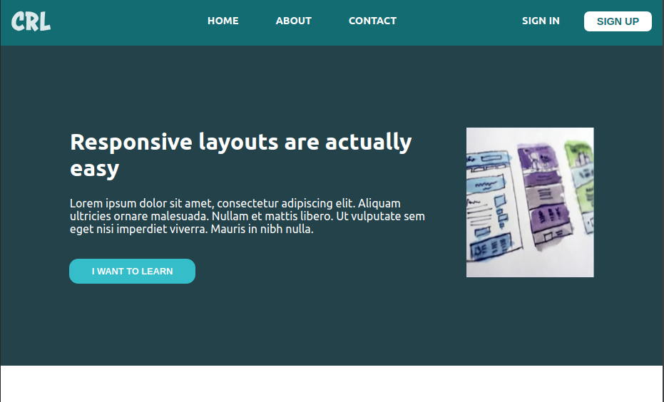

# Course Notes: jQuery, Responsive Design, Node.js
This repo contains notes taken from the following courses:

**The Complete jQuery Course From Beginner To Advanced**

>**Purpose**
- Learn more about jQuery. [Go to folder for more details](https://github.com/SheriffKoder/Course--Phase2--jQuery-ResponsiveDesign-NodeJS/tree/main/courses/jquery/jq-part1)
 

##
**Conquering Responsive Layouts by Kevin Powell**

>**Purpose**
- Learn how to properly approach responsive designs. [Go to folder for more details](https://github.com/SheriffKoder/Course--Phase2--jQuery-ResponsiveDesign-NodeJS/tree/main/courses/kp_resp)

##
**NodeJS - The Complete Guide (MVC, REST APIs, GraphQL, Deno)**

>**Purpose**
- Learn how to setup back-end servers. [Go to folder for more details](https://github.com/SheriffKoder/Course--Phase2--jQuery-ResponsiveDesign-NodeJS/tree/main/courses/nodejs)
