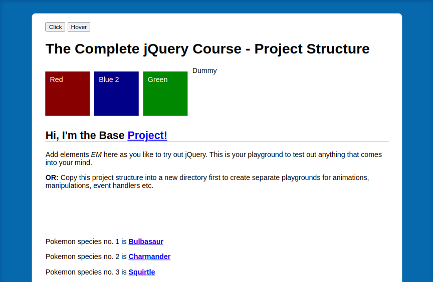
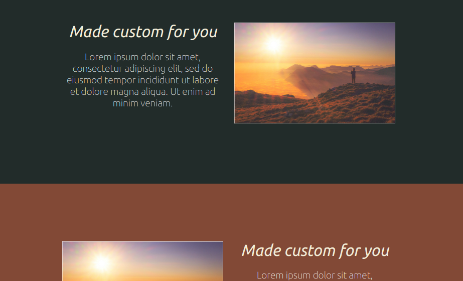

**Conquering Responsive Layouts by Kevin Powell**

>**Purpose**
- Learn how to correctly approach and make websites responsive.
- [Outcome 1](https://htmlpreview.github.io/?https://github.com/SheriffKoder/Course--Phase2--jQuery-ResponsiveDesign-NodeJS/blob/main/courses/kp_resp/part2/challenge3_pt2/index03_pt2.html)
- [Outcome 2](https://htmlpreview.github.io/?https://github.com/SheriffKoder//Course--Phase2--jQuery-ResponsiveDesign-NodeJS/blob/main/courses/kp_resp/part2/challenge4_pt2/index04_pt2.html)
- [Course site](https://courses.kevinpowell.co/conquering-responsive-layouts)

#####
 
##
 