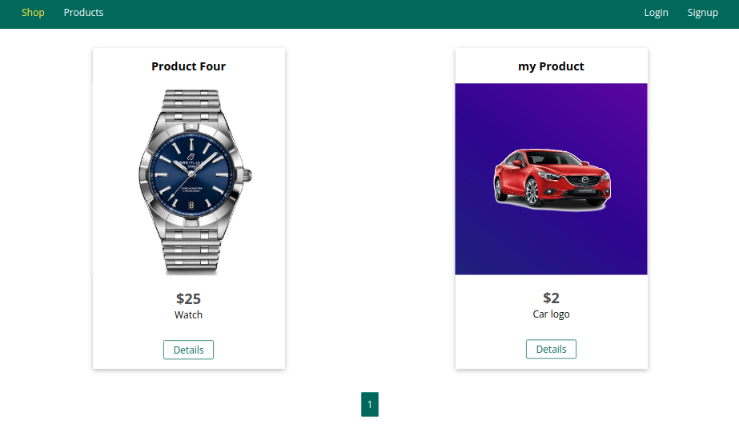

**NodeJS - The Complete Guide (MVC, REST APIs, GraphQL, Deno)**

>**Description**
- 500+ videos course presented NodeJS from its beginnings to its more advanced forms and applications alongside with teaching more about Javascript and better coding practices.
[[ Folder Contents ]](https://github.com/SheriffKoder/Course--Phase2--jQuery-ResponsiveDesign-NodeJS/blob/main/courses/nodejs/contents_sheet.txt)
[[ Course's site ]](https://www.udemy.com/course/nodejs-the-complete-guide/)

>**What is learnt**
- Store from any front-end onto a MongoDB Database.
- Create Databases that sends back HTML documents using Templating Engines.
- Create RESTful APIs (Databases) that can be accessed from any front-end application with the normal fetching methods or with GraphQL queries.
- Develop applications with many types. like online shops and company & services sites etc.

>**Main acquired skills**
- Databases, SQL vs NoSQL, using SQL with Sequelize
- Express.js, NodeJS, MongoDB, Mongoose, GraphQL, Deno, RESTful APIs
- Then/Catch, Async/Await, Fetching Data, CRUD Operations
- Sessions & Cookies, Authentications, Validations, Error handling techniques
- Payments, Uploading, Pagination, using Templatating Engines

>**Outcomes**
- Full-stack "Shop App" using Node.js & ejs Templating engine with user sign-up/sign-in to Add/Edit/Delete products
[[ Folder ]](https://github.com/SheriffKoder/Course--Phase2--jQuery-ResponsiveDesign-NodeJS/tree/main/courses/nodejs/section22) [[ Live Site ]](https://phase2-nodejs.onrender.com/)
- Another version of the "Shop App" using a GraphQL REST API
[[ Folder ]](https://github.com/SheriffKoder/Course--Phase2--jQuery-ResponsiveDesign-NodeJS/tree/main/courses/nodejs/section28)
- A lite version of the "Shop App" using mySQL / sequelize without user sign-up/sign-in
[[ Folder ]](https://github.com/SheriffKoder/Course--Phase2--jQuery-ResponsiveDesign-NodeJS/tree/main/courses/nodejs/section10) [[ Live Site ]](https://phase-3-1ty9.onrender.com/)
#####
>**Screenshot - Shop App**

 